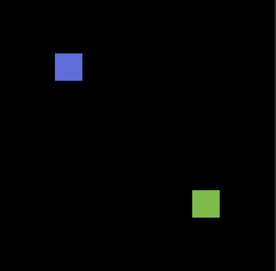
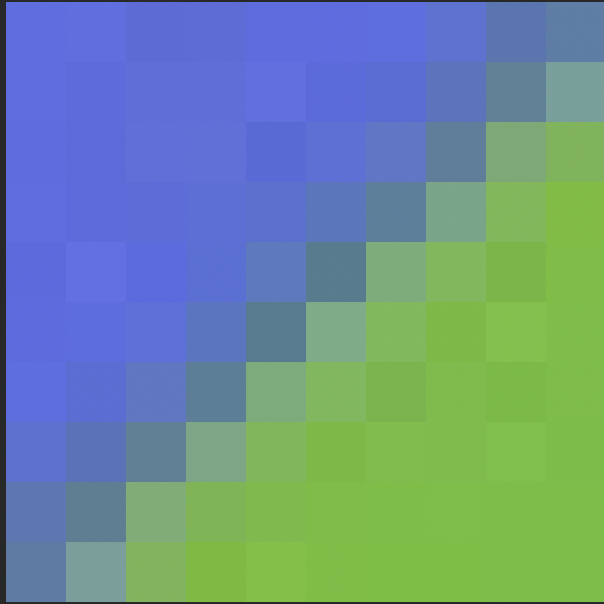
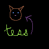

# Aria's Thesis Blog :partying_face:

## *Basically a place where I will dump all my thoughts about the process and my feelings about thesis-life*

# 10.10.2022
### *Continuing with Edge Detection, Going Beyond Mr. Gaussian*

In the "Automated Hedcut Illustration Using Isophotes" [Sung Ye Kim et al.] they use DoG for getting edges plus more, today I am looking at what that more is. These are their steps:

- [x] use DoG with sigma_1 = 1.0 and sigma_2 = 1.5 
    - right now I'm doing a kernel of (3, 3) and (9, 9) and I think that looks better but I'm open to changing it
- [ ] remove edges with a length less that some predefined threshold
    - how do they find these edges?
- [ ] employ a morphological opening operation with a structuring element of a circle in order to alleviate nose and smooth the edges (radius 1)
    - [ ] [binary erosion](https://en.wikipedia.org/wiki/Erosion_(morphology))
    - [ ] [binary dilation](https://en.wikipedia.org/wiki/Dilation_(morphology))


# 10.09.2022 
### *Who is Mr. Gaussian and why is he so important?*

Today I shall attempt to implement DoG! I understand the basics of the algorithm:

    1. blur image with high sigma
    2. blur image with low sigma 
    3. subtract the two and now you have the edges!

Here is what I don't understand 

- [x] What is sigma?
- [x] What is a Gaussian kernel?

[This stack overflow post](https://stackoverflow.com/questions/17841098/gaussian-blur-standard-deviation-radius-and-kernel-size) is helpful for how to pick `sigma` and the `kernel` (I guess it is standard to have the `kernel` be something like 3 * `sigma` or 4 * `sigma` + 0.5). I'll look and see if any of the papers say what `sigma` and `kernel` size they use. 

Another thing that I need to do is figure out `CMake` because having all my code in one file is unideal...

# 10.08.2022
### *OMG I finally figured it out!!!*
<br>
I've missed a couple days but basically what I have done recently is fix my opencv install since it was previously not working and 
then reimplement jfa but in c++. 

For a couple of days I was having an issue where I would run jfa and it would do the flood but the output image appeared to have a 
gradient on it. I had no clue what was happening since I looped through all the pixels right before I wrote them out and they were all 
okay but when I looked at the image it was clearly not correct and using a color picker showed that some of them were not what they should be. It turns out what was going on was I was running jfa on a `.png` and then writing it out as a `.jpg` which was messing with the colors. 

<p align = "center">


<br>
Fig.1 - Input image
<br>


<br>
Fig.2 - Weird jfa 
<br>

<br>
Fig.3 - Correct jfa
</p>


# 10.4.22
### *Fixing Include paths and Cython to the resccue!*
<br>

First thing I did today was fix my include paths in VS Code. I am still having errors compiling c++ code, just linker failures
that I need to take a second and look back at. 

Since `opencv` works with python and c++ my plan (Jim's suggestion) is to use both python and c++ throughout the process, hopefully 
settling on c++ for final things. So I want to go back and change all my python code to work with `opencv` rather than `PILLOW`. From 
what I've read `for` loops are really slow in `opencv` which is ofc not great. My Googling has led me to `Cython` which should fix these 
performance issues. So now I am working on learning `Cython` and then using `Cython` to speed up `opencv`! 

# 10.3.22

### *Playing around with things in c++*
<br>

# 10.01.22

### *Finalizing code for Jump Flooding Algorithm*
<br>
I've been trying to run the code for the JFA and have run into a number of small bugs that I have fixed:

- [x] Better prompts for user input and allowing for resizing of input images that aren't `N x N` squares
- [x] For the seed dictionary entries need to be tuples, not lists since you cannot hash a mutable object
- [x] Making sure that when I loop through the neighbors I don't go out of bounds on the image

The main issue that I'm facing is that this algorithm is *super slow*. It does have  O(N^2 log2(N)) complexity. But I think I am implementing something wrong and have some extra loops because this is taking way too long. 

Still running slow but I made input images using Aseprite that are super small and I have been able to run the code and see 
that it works!

For example, here is a drawing of my roommates cat:


</p>
<p align = "center">
Fig.1 - My roommates cat, Tess
</p>


</p>
<p align = "center">
Fig.2 - My roommates cat, Tess after being jump flooded
</p>

Also thinking about edge detection, Laplacian of Gaussian seems promising and [python has a built in function](https://stackoverflow.com/questions/22050199/python-implementation-of-the-laplacian-of-gaussian-edge-detection) for part of the algorithm. 


## 09.30.22

### *Working on basic image operations! Converting an image to grayscale and implementing the Jump Flooding Algorithm.*
<br>
Grayscaling an image was easy to implement in `js` and in `python` (having a bit of trouble with `pyscript` due to the `pyodide` module not downloading). 

When I started trying to implement the jump flooding algorithm in `js` I realized that it would be somewhat tricky / expensive. This is because the pixels need to hold more information that just their `r, g, b` values (what their seed pixel is). Since we can't edit the pixels that we get when iterating over the image as an array my idea was to create a dictionary like so:

```
    pix_map = {}
    pix_map[[c,r]] = [r_s, c_s]
```
Each `[c, r]` pair that represents a pixel is mapped to the `[r_s, c_s]` pair that represents its seed pixel. However js has no dictionary type. I could create a custom object however that would defeat the purpose of a dictionary having `O(1)` lookup time. So I think for my thesis using `pyscript` will be the way to go. 


