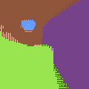

# Aria's Thesis Blog :partying_face:

## *Basically a place where I will dump all my thoughts about the process and my feelings about thesis-life*

## break goals 

- [ ] Link together `edge-detection`, `isophote-detection`, and `offset-map` in `kitten-caboodle` file
    - [x] fix thresholding in `isophote-detection` 
- [ ] Clean up code and images
- [ ] Finish background section of writing
- [ ] Write about offset map generation process 

## 01.06.2022

New issue! When I am trying to get the edges from an the red sphere they are coming back with a lot of noise. 

<p align = "center">


Fig.1 - Sphere noise
</p>

I think a fairly easy way to fix this would be to apply the bilateral filtering
that is done for extracting isophotes to smooth things. Maybe even do the 
binning too. Okay here is the sphere after bilateral filtering. That worked but not all the way... 

<p align = "center">


Fig.2 - Less sphere noise
</p>

## 01.05.2022

I have made it so `extractEdges` and `extractIsophotes` take a threshold parameter, that
way in so these functions can be tuned to image and for `extractEdges` you can threshold
lower when working with the isophotes image. 
I also fixed the heap so that the lightest values are at the top, not the darkest.

I've tested things with Cameron and Beyonce and things look pretty good!

<p align = "center">


Fig.1 - New isophote extraction
<br>
</p>


I think that the issue in `caboodle` is that the image I'm testing on has a 
black background. The edge and isophote detection works great but the offset
map is coming back all white. I want to find a way to tell what color the background of an image is so that if it is black I can just invert it. I 
think this should be easy enough with `connectedComponents`. That was indeed the issue!

## 01.04.2022 

For whatever reason `cv::threshold` is not working, so I needed to do that manually.

## 01.03.2022 

So it turns out that the issue with the `diff-comps.png` image getting its isphotes 
extracted is not an issue (I think). Basically the light blue and white get reduced
to the same color when the `process` function is called which is why that section was
not showing up. And I think that's totally fine bc it makes sense for them to reduce
to the same spot. 


## 12.27.2022

I think the most efficient way to do this would be to make a min heap with the value 
(frequency of the color) determining order. 

## 12.26.2022 

Okay after giving it some thought I don't think that method with the connected components 
will actually work because if you have two segments that are next to each other but are 
different colors then they will be considered the same component like this:

    xxxyyy
    xxxyyy

I think that it would actually be faster to do what I need to do, which is find the 
lightest color, is just do a pass over the image and track the lightest pixels. 

## 12.24.2022 

Working on my thesis because I know that's what Jesus would have wanted :) 
Before I work on placing the dots I want to return to the `kitten-caboodle` folder and see about linking everything that I have so far together and, even through I am reluctant
to do so, run some actual images through what I have. I also need to do some Spring cleaning on my code base. Let's just make a list of what to do over break:

- [] Link together `edge-detection`, `isophote-detection`, and `offset-map` in `kitten-caboodle` file
- [] Clean up code and images
- [] Finish background section of writing
- [] Write about offset map generation process 

Okay here is the sate I am leaving things at for tn before I go celebrate that "600 years ago today on a cold north pole night something magical happened under a star that shined so bright that is right it is the birth of our lord saviour baby jesus christ." - Chris Simpsons Artist

There is a bug in extract isophotes where if the isophotes are too dark (above 64 in grayscale) they don't get extracted! Here is my proposed fix: 

1. extract connected components
2. find lowest colors among components
3. threshold based off that

I shall do that some other time. 

## 12.09.2022

Quick update on how I fixed the distance map thing. What I really needed to do was just implement the algorithm from the paper because, plot twist, it works. This involved changing a couple of things:
1. the type of the matrix was `uchar`s but it should be `int32_t`
2. the funciton `f` just returns the pixel value or `INT32_MAX` if the value would be `255` 
3. correctly adding to and removing from the vector `v`

## 12.01.2022
**Yeah Yeah Yeah It's Been Awhile, Let's Brain Dump**

What I need to figure out is how I should be adding to the lower envelope when f(v[k]) = INT_MAX

## 11.20.2022 
**What the heck is up with my JFA**

I really have no idea what else is wrong with my JFA, the only thing that I can think to do to fix it is to run a bilateral filter in order to get rid of the noise. 

<p align = "center">


Fig.1 - More improvements
<br>
</p>

## 11.17.2022
**It's been a minute**

Okay here are the main updates:

Last week I did a lot of writing, I have a layout that I feel pretty confident about. My goal for the rest of the
semester is to have a draft of my background chapter by the end of the semester. I think that is feasible, here is 
what needs to be done for that:

- [ ] clean up "representing images on a computer" based on the info in the big book (not the bible but that really thick computer graphics textbook)
- [ ] write about color spaces
- [ ] write canny edges detection  
- [ ] write color conversion 
- [ ] write DoG

I also want to try to finish the implementation that I am currently working towards. That is kind of a big thing but I think it is feasible! Here is what needs to be done for that:

- [ ] fix JFA
- [ ] redo offset map algorithm 
- [ ] figure out dot placement

Recently I've been working on fixing the JFA. I fixed a small bug by changing the conditional for check if a pixel is set from the color to the seed it currenlty has in seed_map. But I am still getting weird things :(

<p align = "center">


Fig.1 - Resolving a small bug :)
<br>
</p>


## 11.01.2022
**Distance Maps** 

Okay according to wikipedia jfa is good enough for Voronoi diagrams so that is what I shall do. However, I am worried that
my JFA that I already have is not quite good enough so I shall do some research about implementing this with specifically opencv. 

Okay so basically jfa is super super slow if the image is larger. 

## 10.31.2022
**Isophote Extraction** 

Okay I came up with a pretty good way to doing isophote extraction. Here is the algorithm 

    image = read(img);

    for (i < MAX_KERNEL_LENGTH) {
        apply bilateral filter to image;
    }

    image = convert-to-CIELab;

    // luminance quatization and remove a and b 
    // now color in image represents luminance
    processColors(image);

    image = grayscale(image);
    image = threshold(image);

    return image;


This will give back a binary image with only the isophotes. Then you can run DoG on the result and you will have the isophotes!

<p align = "center">


Fig.1 - Beyonce! Fig.2 - Beyonce where color corresponds to luminance. Fig.3 - Beyonce's isophotes (kinda spooky for halloween). 
<br>
</p>

So I think the only things I need to do for edge extraction are to fix the fact that the lines are disconnected with means that not
a lot of them meet the threshold. 

Since I don't really know how to fix that I will look into the Weighted Distance Map Generation. 

Hmm here are some things I don't get about Distance Map Generation:
1. "Edges have default priority" what does that mean? That they have priority one?
2. How do we get the min over all the (x', y') on the isophote? Probably a connected components thing to find the isophote and 
then use the centroid and go from there but that just seems so inefficient. 
3. What is the deal with this parent priority buffer thing?

## 10.28.2022 

**Closing Gaps in Lines**

One of the issues I have notices with the thresholding faces is that there are actually very few lines that meet
a given threshold. If the threshold is 200 there are maybe 2 or 3 lines which leads to output that doesn't really 
look like a face at all. This is a big issue with delicate features like eyes, noses, and lips. 
In order to fix this I need to close all these little gaps in lines that are generated after running DoG. 

<p align = "center">


Fig.1 - Fabios eyes after DoG. 
<br>
</p>

I think I found a way to do this using [contours](https://answers.opencv.org/question/53548/gap-filling-contours-lines/). 

Also, there is an issue with DoG being super finicky. It works pretty good for Fabio but not that great for Cameron. 

<p align = "center">


Fig.1 - Fabio versus Cameron with DoG. 
<br>
</p>

Jotting down a quick idea:

It seems like running edge extraction of the bilaterally filtered image gives good isophotes, but we aren't extracting them. 
What if to figure out what is an isophote or not you get the edges of the regular image, and those of the filtered image and 
then just do iso - reg to get just the isophotes? That way we can distinguish them.


## 10.27.2022 

**Isophote time!** 

Isophotes look pretty good! There are a few things that I fixed in order to fix things: 
1. Convert image back to RGB before writing it out, this made colors look good 
2. Perform a bilateral filter before running CIELab and quantization, this makes it so the segments are smoother. 

<p align = "center">


Fig.1 - Beyonce before and after bilateral filtering + CIELab luminance quantization. 
<br>
</p>

## 10.26.2022

**OKAY OKAY OKAY!!!!! I THINK I FIXED IT!!! I THINK ITS WORKING!!**

Here is the final algorithm:


    isolate(comp, i) {
        comp.copyTo(isolated);
        set any pixel that is not equal to i to black;
        return isolated;
    }

    threshold {
        read in image;

        convert to binary;

        cv::Mat labels;
        cv::Mat stats;
        cv::Mat centroids;
        int numComps =  cv::connectedComponentsWithStats(image, labels, stats, centroids); 

        std::unordered_map<int, bool> remove; 

        for each component except the background  {
            comp = just the component;
            isolated = isolate(comp, i); 
            skel = skeleton(isolated);
            remove[i] = !meetsThreshold(skel, theshhold);
        }

        for each pixel in the labeled image {
            color = pixel;

            if remove[color] {
                pixel = 0;
            }
        }
        
    }

<p align = "center">


Fig.1 - Lines before and after removing edges of length less than 50 pix. 
<br>
</p>

## 10.25.2022
###

Questions before my meeting:

1. What do you call something that is not AI/ML?
2. Why does CIE LAB look like that 
    - convert to CIELab space 
    - so then do binning based on L
    - then convert back to RBG ? just to see if things look good 
3. What do I do about the connected components thing just in general being able to remove components 

Okay I think I figured out how to do edge detection! 
1. read in image
2. convert to binary 
3. get components
4. for each component
    1. extract what is in the bounding box for that component from the labeled image (you might end up with multiple components!)
    2. loop over that extraction and if there is a pixel that is not black or the color of the current component make it black, this way we are getting rid of extra components that would have gotten extracted 
    3. get the skeleton of what is left over 
    4. check if it meets the threshold 
    5. if it does not remove that component by looping over that section of the labeled image and setting any pixels of that color to black 
5. threshold labeled image again to set any gray to white

Hmmmm, it looks like we are getting stuck in an infinite loop??? It was because skeleton gets stuck if the input image is small and all white so I have fixed that. 

I'm going to change things so that if a color needs to be removed I add it to a dictionary and then I'll loop over the whole image jsut once and check if the pixel color maps to -1. 

# 10.24.2022 
### *I have a lot of problems* 

List of Problems:
1. DoG looks weird with akb.png 
    - maybe it's just not supposed to be used with something so small and square?
    - okay I ran it with a bigger input file and it worked!!!!!!
2. How do I remove the small edges that I want to remove? 
3. ConnectedComponents doesn't quite do what I want it to do because it will count a square in a square as one thing
4. CIE LAB looks weird 
5. Binning is weird because ^ is weird 

I think a lot of this has to do with what the type of the image is...


# 10.20.2022
### 

Steps for gosh darn edge detection 

1. DoG 
2. Remove edges with length less that predefined threshold:

    i. for each connected component:

        I. find the skeleton 
        II. compute the total length of the skeleton 
3. morphological opening operation with circle 

It looks like getting the skeleton on an image is different that getting a the skeleton on a connected component of an image. For example this 
is the skeleton of my initials:

<p align = "center">


Fig.1 - Input image and its skeleton. 
<br>
</p>

Here are the connected components and their skeletons:

<p align = "center">


Fig.2 - A connected component and its skeleton. 
<br>
</p>

There is a difference in the skeleton of the "a" when it is in the big image versus when it is a component. 

So I will try to run the skeleton first and then get the components and see what happens then.

Okay so I did that and now the skeleton of the big images matches the skelton of the components:
<p align = "center">


Fig.3 - Image skeleton and one of its components. 
<br>
</p>

But the issue is that I am getting back 4 components, each of the letters and then part of the "k"

<p align = "center">


Fig.4 - The full "k" component and a component that is just the "k"'s leg. 
<br>
</p>

# 10.18.2022
### *Hello from FSD airport floor while plane is delayed because THEY FORGOT TO PUT ANTI FREEZE IN IT!!* 


# 10.11.2022
###

I think I figured out how CMake works, now I shall do some code cleaning up bc there is a lot going on in my code rn. 

# 10.10.2022
### *Continuing with Edge Detection, Going Beyond Mr. Gaussian*

In the "Automated Hedcut Illustration Using Isophotes" [Sung Ye Kim et al.] they use DoG for getting edges plus more, today I am looking at what that more is. These are their steps:

- [x] use DoG with sigma_1 = 1.0 and sigma_2 = 1.5 
    - right now I'm doing a kernel of (3, 3) and (9, 9) and I think that looks better but I'm open to changing it
- [ ] remove edges with a length less that some predefined threshold
    - how do they find these edges?
- [ ] employ a morphological opening operation with a structuring element of a circle in order to alleviate nose and smooth the edges (radius 1)
    - [ ] [binary erosion](https://en.wikipedia.org/wiki/Erosion_(morphology))
    - [ ] [binary dilation](https://en.wikipedia.org/wiki/Dilation_(morphology))
    - heck yea! opencv has a [library function](https://docs.opencv.org/3.4/db/df6/tutorial_erosion_dilatation.html) to do this :partying_face: 

Update, everything is working well expect that I can't figure out how to remove lines with a length less that 200 pixels. Maybe 
doing repeated opening would work? That does **not** work it just makes things look funny and shifted. But alas! Opencv has a [function for that](https://docs.opencv.org/3.4/d3/dc0/group__imgproc__shape.html#ga107a78bf7cd25dec05fb4dfc5c9e765f)!

<p align = "center">


Fig.1 - Input image, output after 1, 2, 3, 4, 5 iterations of opening. 
<br>


# 10.09.2022 
### *Who is Mr. Gaussian and why is he so important?*

Today I shall attempt to implement DoG! I understand the basics of the algorithm:

    1. blur image with high sigma
    2. blur image with low sigma 
    3. subtract the two and now you have the edges!

Here is what I don't understand 

- [x] What is sigma?
- [x] What is a Gaussian kernel?

[This stack overflow post](https://stackoverflow.com/questions/17841098/gaussian-blur-standard-deviation-radius-and-kernel-size) is helpful for how to pick `sigma` and the `kernel` (I guess it is standard to have the `kernel` be something like 3 * `sigma` or 4 * `sigma` + 0.5). I'll look and see if any of the papers say what `sigma` and `kernel` size they use. 

Another thing that I need to do is figure out `CMake` because having all my code in one file is unideal...

# 10.08.2022
### *OMG I finally figured it out!!!*
<br>
I've missed a couple days but basically what I have done recently is fix my opencv install since it was previously not working and 
then reimplement jfa but in c++. 

For a couple of days I was having an issue where I would run jfa and it would do the flood but the output image appeared to have a 
gradient on it. I had no clue what was happening since I looped through all the pixels right before I wrote them out and they were all 
okay but when I looked at the image it was clearly not correct and using a color picker showed that some of them were not what they should be. It turns out what was going on was I was running jfa on a `.png` and then writing it out as a `.jpg` which was messing with the colors. 

<p align = "center">


<br>
Fig.1 - Input image
<br>


<br>
Fig.2 - Weird jfa 
<br>

<br>
Fig.3 - Correct jfa
</p>


# 10.4.22
### *Fixing Include paths and Cython to the resccue!*
<br>

First thing I did today was fix my include paths in VS Code. I am still having errors compiling c++ code, just linker failures
that I need to take a second and look back at. 

Since `opencv` works with python and c++ my plan (Jim's suggestion) is to use both python and c++ throughout the process, hopefully 
settling on c++ for final things. So I want to go back and change all my python code to work with `opencv` rather than `PILLOW`. From 
what I've read `for` loops are really slow in `opencv` which is ofc not great. My Googling has led me to `Cython` which should fix these 
performance issues. So now I am working on learning `Cython` and then using `Cython` to speed up `opencv`! 

# 10.3.22

### *Playing around with things in c++*
<br>

# 10.01.22

### *Finalizing code for Jump Flooding Algorithm*
<br>
I've been trying to run the code for the JFA and have run into a number of small bugs that I have fixed:

- [x] Better prompts for user input and allowing for resizing of input images that aren't `N x N` squares
- [x] For the seed dictionary entries need to be tuples, not lists since you cannot hash a mutable object
- [x] Making sure that when I loop through the neighbors I don't go out of bounds on the image

The main issue that I'm facing is that this algorithm is *super slow*. It does have  O(N^2 log2(N)) complexity. But I think I am implementing something wrong and have some extra loops because this is taking way too long. 

Still running slow but I made input images using Aseprite that are super small and I have been able to run the code and see 
that it works!

For example, here is a drawing of my roommates cat:


</p>
<p align = "center">
Fig.1 - My roommates cat, Tess
</p>


</p>
<p align = "center">
Fig.2 - My roommates cat, Tess after being jump flooded
</p>

Also thinking about edge detection, Laplacian of Gaussian seems promising and [python has a built in function](https://stackoverflow.com/questions/22050199/python-implementation-of-the-laplacian-of-gaussian-edge-detection) for part of the algorithm. 


## 09.30.22

### *Working on basic image operations! Converting an image to grayscale and implementing the Jump Flooding Algorithm.*
<br>
Grayscaling an image was easy to implement in `js` and in `python` (having a bit of trouble with `pyscript` due to the `pyodide` module not downloading). 

When I started trying to implement the jump flooding algorithm in `js` I realized that it would be somewhat tricky / expensive. This is because the pixels need to hold more information that just their `r, g, b` values (what their seed pixel is). Since we can't edit the pixels that we get when iterating over the image as an array my idea was to create a dictionary like so:

```
    pix_map = {}
    pix_map[[c,r]] = [r_s, c_s]
```
Each `[c, r]` pair that represents a pixel is mapped to the `[r_s, c_s]` pair that represents its seed pixel. However js has no dictionary type. I could create a custom object however that would defeat the purpose of a dictionary having `O(1)` lookup time. So I think for my thesis using `pyscript` will be the way to go. 


